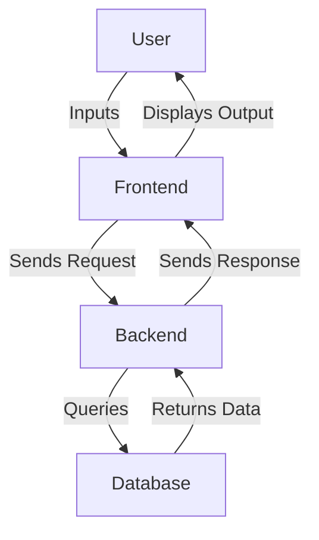

# Interactive ML Model Explainer with Streamlit Auto

## Overview
The **Interactive ML Model Explainer with Streamlit Auto** is a web-based application designed to provide users with an intuitive interface to explore and understand machine learning models. This project aims to bridge the gap between complex machine learning algorithms and end-users by offering real-time predictions and visual explanations of model decisions. It is particularly beneficial for data scientists, engineers, educators, and anyone interested in gaining insights into machine learning models without delving into the underlying code.

The application leverages FastAPI for backend services, providing a robust and scalable framework for handling API requests. The frontend is designed with a clean and responsive interface, ensuring a seamless user experience across devices. Users can input features, receive predictions, and understand the rationale behind these predictions through clear explanations.

## Features
- **Real-Time Predictions**: Input features and receive instantaneous predictions from the machine learning model.
- **Model Information**: Access detailed information about the model, including its name, version, and accuracy metrics.
- **Feature Exploration**: View a comprehensive list of features used by the model, aiding in understanding the model's input parameters.
- **Interactive UI**: A user-friendly interface with smooth navigation and responsive design, enhancing user engagement.
- **API Documentation**: Easily accessible API documentation, allowing developers to integrate and utilize the model's capabilities programmatically.
- **Docker Support**: Simplified deployment with Docker, ensuring consistency across different environments.

## Tech Stack
| Component      | Technology  |
|----------------|-------------|
| Backend        | FastAPI     |
| Frontend       | HTML, CSS, JavaScript |
| Database       | SQLite      |
| Server         | Uvicorn     |
| Containerization | Docker   |

## Architecture
The project architecture is designed to separate concerns and ensure scalability:
- **Backend**: FastAPI serves as the backend framework, handling API requests and database interactions.
- **Frontend**: Static HTML, CSS, and JavaScript files provide the user interface, served by FastAPI's static file handling.
- **Database**: SQLite is used for storing model information and features.

### Data Flow


## Getting Started

### Prerequisites
- Python 3.11+
- pip (Python package manager)
- Docker (optional, for containerized deployment)

### Installation
1. Clone the repository:
   ```bash
   git clone https://github.com/yourusername/interactive-ml-model-explainer-with-streamlit-auto.git
   cd interactive-ml-model-explainer-with-streamlit-auto
   ```
2. Install dependencies:
   ```bash
   pip install -r requirements.txt
   ```

### Running the Application
1. Start the FastAPI application:
   ```bash
   uvicorn app:app --reload
   ```
2. Open your browser and visit `http://localhost:8000` to access the application.

## API Endpoints
| Method | Path              | Description                                        |
|--------|-------------------|----------------------------------------------------|
| POST   | /api/predict      | Accepts feature input and returns prediction and explanation. |
| GET    | /api/model-info   | Returns information about the machine learning model. |
| GET    | /api/features     | Returns a list of features used in the model.      |

## Project Structure
```
interactive-ml-model-explainer-with-streamlit-auto/
├── Dockerfile               # Docker configuration file for containerization
├── app.py                   # Main application file containing FastAPI code
├── requirements.txt         # Python dependencies
├── start.sh                 # Shell script to start the application (if applicable)
├── static/
│   ├── css/
│   │   └── style.css        # Custom styles for the application
│   └── js/
│       └── main.js          # JavaScript for interactive functionality
└── templates/
    ├── about.html           # About page template
    ├── api-docs.html        # API documentation page template
    ├── explainer.html       # Model explainer page template
    └── index.html           # Home page template
```

## Screenshots
*Screenshots of the application interface will be added here.*

## Docker Deployment
1. Build the Docker image:
   ```bash
   docker build -t interactive-ml-model-explainer .
   ```
2. Run the Docker container:
   ```bash
   docker run -p 8000:8000 interactive-ml-model-explainer
   ```

## Contributing
Contributions are welcome! Please follow these steps:
1. Fork the repository.
2. Create a new branch (`git checkout -b feature/YourFeature`).
3. Commit your changes (`git commit -am 'Add new feature'`).
4. Push to the branch (`git push origin feature/YourFeature`).
5. Create a new Pull Request.

## License
This project is licensed under the MIT License. See the LICENSE file for more details.

---
Built with Python and FastAPI.